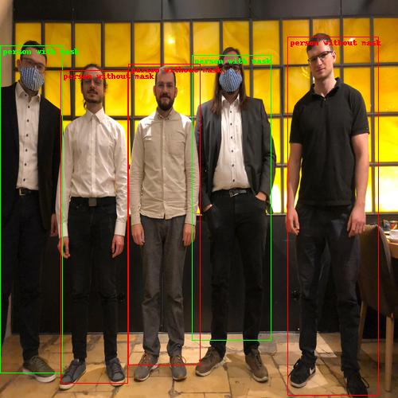

# Mask-Classfier
https://neuroforge.de/maskentraegererkennung-durch-neuronale-netzen-wie-ein-mvp-aussehen-kann/

Based on: https://github.com/FurkanOM/tf-faster-rcnn

# Usage
Draw bounding boxes around persons and label them as "person with mask" or "person without mask"

# To do
* train_faster_rcnn  
* use crop_persons_via_faster_rcnn to crop persons from own dataset 
* classify the cropped persons by hand into the two classes
* use cnn_trainer on this classified images  
* use predict on your images to get bounding boxes and associated labels  

# Example

